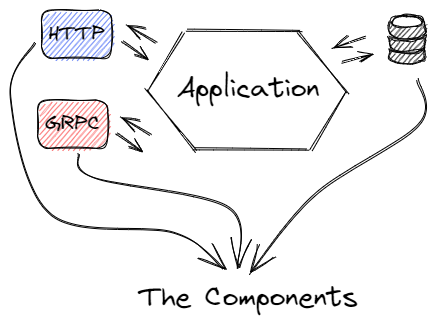
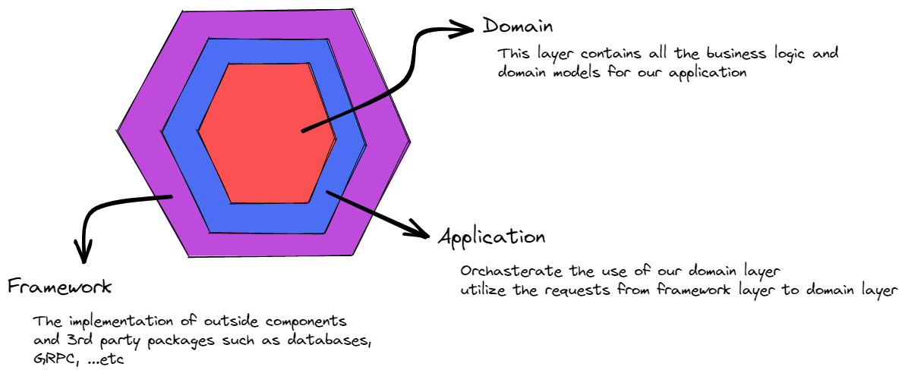

# ports-adapters-arch-template

This is a template that I will use in my following projects which sets a hexagonal architecture base for go project

## What is the Hexagonal (Ports & Adapters) Architecture ?

➜ This architecture is used when our aim is to decouble the application components  
➜ This will allow us to replace components easily, connect different components to the application, and test each component/module easily.  
➜ The Aim of this architecture is that our business doesn't depends on the components that are driving it (uses or application) for exaple we don't care if our api is gonna be used via HTTP or GRPC or a terminal app or ....etc, nor the components that our business drives (our business uses/depends on) for example we don't care which database we will use.

## The Architecture Layers ?

## How we manage the dependencies between layers ?

➜ For the `Application layer` to use the database from the `framework layer`, we don't call the `framework layer` to instantiate a new db instance and perform the operations we want, instead we let our startup program instantiate an instance and inject it in the `Application layer`, so we will use the `dependency injection` for that.
